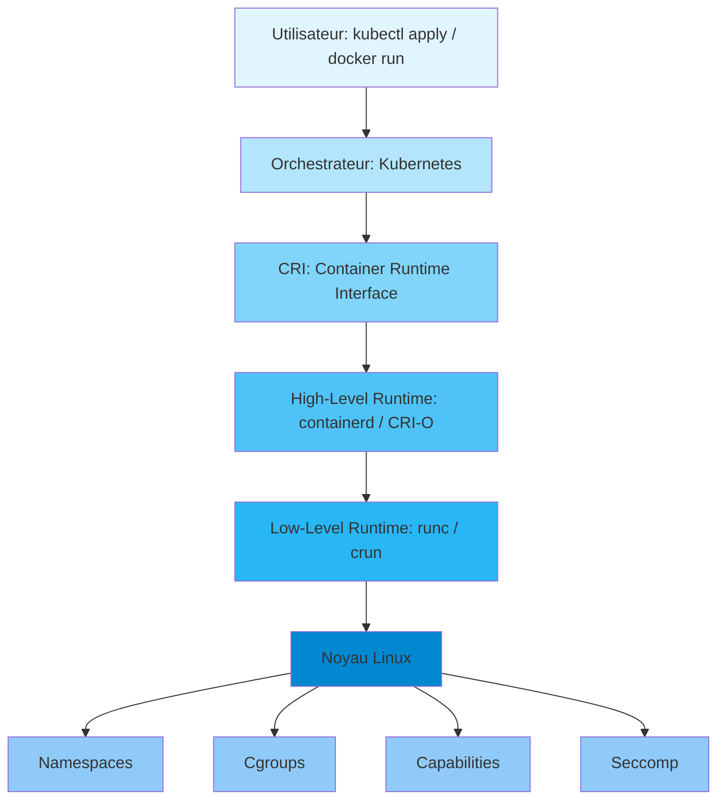
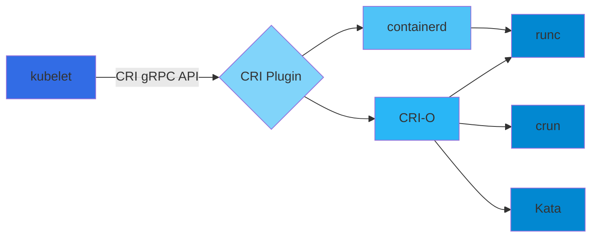

# Architecture des Conteneurs et Container Runtimes

## Ressources

Ce document s'appuie sur les ressources suivantes :
- [Ultimate Guide to Container Runtimes: From Docker to RunC and Beyond](https://dev.to/xavki/ultimate-guide-to-container-runtimes-from-docker-to-runc-and-beyond-3k4k)
- [Container Security Best Practices](https://www.serverwatch.com/guides/what-is-container-and-containerization/)
- [Container Runtimes Explained](https://www.upwind.io/glossary/container-runtimes-explained)
- [Docker vs Containerd vs Runc](https://medium.com/@bibhup_mishra/docker-vs-containerd-vs-runc-c39ffd4156fb)

---

## Introduction

La conteneurisation est au cœur des technologies cloud-native modernes. Elle permet aux développeurs d'empaqueter des applications avec toutes leurs dépendances dans une unité unique, garantissant la cohérence entre les environnements - du laptop du développeur jusqu'au cluster Kubernetes de production.

Mais qu'est-ce qui se passe réellement lorsque vous exécutez `docker run` ou que vous déployez un Pod Kubernetes ? C'est là qu'intervient une stack puissante de **container runtimes** qui travaillent en coulisses pour exécuter ces conteneurs.

---

## Qu'est-ce qu'un Container Runtime ?

Un **container runtime** est un programme logiciel conçu pour déballer une image de conteneur et la transformer en un processus en cours d'exécution sur un ordinateur. Le runtime interagit avec l'environnement - que ce soit dans le cloud, sur un serveur bare-metal, ou sur un hôte Linux - et sa fonction principale est de récupérer l'image du conteneur et de transformer tout ce qu'elle contient en une application fonctionnelle.

Sans runtime, les conteneurs restent des images statiques et non fonctionnelles d'applications. Les runtimes, sous toutes leurs variantes, garantissent que les conteneurs fonctionnent efficacement tout au long de leur cycle de vie.

### Responsabilités principales d'un Container Runtime

Les container runtimes ont trois responsabilités fondamentales :

1. **Exécution des conteneurs**
   - Démarrer et gérer les conteneurs tout au long de leur cycle de vie
   - Surveiller la santé des conteneurs et les redémarrer en cas d'échec
   - Nettoyer lorsque le conteneur termine ses tâches

2. **Interaction avec le système d'exploitation hôte**
   - Utiliser les fonctionnalités du noyau Linux (namespaces, cgroups) pour isoler et gérer les ressources
   - Garantir que les processus à l'intérieur des conteneurs ne peuvent pas perturber l'hôte ou d'autres conteneurs

3. **Allocation et gestion des ressources**
   - Allouer et réguler le CPU, la mémoire et les I/O pour chaque conteneur
   - Éviter la monopolisation des ressources dans les environnements multi-tenants

---

## Container Engine vs Container Runtime

Il est essentiel de comprendre la différence entre un **container engine** et un **container runtime** :

### Container Engine (Moteur de conteneurs)
- Programme logiciel qui accepte les requêtes des utilisateurs
- Inclut une interface en ligne de commande (CLI)
- Récupère les images de conteneurs
- Du point de vue de l'utilisateur, c'est lui qui "lance" le conteneur
- **Exemples** : Docker (avec dockerd), Podman

### Container Runtime
- Opère directement sur le conteneur
- Gère le cycle de vie bas niveau du conteneur
- Interagit directement avec le noyau Linux
- **Exemples** : containerd, CRI-O, runc, crun

**Analogie** : Le container engine est comme le "tableau de bord" d'une voiture (interface utilisateur), tandis que le container runtime est le "moteur" qui fait réellement tourner les roues.

---

## Types de Container Runtimes

Il existe trois catégories générales de container runtimes, séparées principalement en fonction de leur proximité avec les conteneurs eux-mêmes.

### 1. Low-Level Runtimes (Runtimes de Bas Niveau)

Les runtimes de bas niveau sont les plus proches du noyau Linux. Ils sont responsables du lancement du processus conteneurisé et ont l'interaction la plus directe avec les conteneurs.

#### Caractéristiques
- Implémentent la spécification OCI (Open Container Initiative)
- Font le travail réel de création, démarrage et arrêt des instances de conteneurs
- Interagissent directement avec les fonctionnalités du noyau (namespaces, cgroups, capabilities)

#### Exemples principaux

**runc**
- Runtime de référence pour les conteneurs
- Créé à l'origine par Docker, donné à l'OCI en 2015
- Le standard de facto pour l'exécution de conteneurs
- Outil CLI léger qui crée des conteneurs à partir d'un fichier de config OCI

**crun**
- Runtime axé sur la légèreté et l'efficacité
- Binaires d'environ 300 Ko
- Alternative performante à runc

**runhcs**
- Fork de runc créé par Microsoft
- Permet d'exécuter des conteneurs sur des machines Windows

### 2. High-Level Runtimes (Runtimes de Haut Niveau)

Les runtimes de haut niveau offrent une plus grande abstraction que leurs homologues de bas niveau. Ils sont responsables du transport et de la gestion des images de conteneurs, du déballage, et de la transmission au runtime de bas niveau pour exécuter le conteneur.

#### Caractéristiques
- Offrent des interfaces utilisateur conviviales
- Gèrent les images de conteneurs
- Fournissent des API pour l'intégration
- Délèguent l'exécution réelle aux low-level runtimes

#### Exemples principaux

**Docker (containerd)**
- Le système de conteneurs le plus populaire
- Utilise containerd en interne
- Runtime Kubernetes le plus courant
- Fournit : spécifications d'images, CLI, service de construction d'images

**containerd**
- Projet dérivé de Docker, maintenant utilisé par Kubernetes
- Runtime de production prêt pour l'entreprise
- Fournit l'exécution de conteneurs et la gestion d'images sans fonctionnalités supplémentaires
- Suit les spécifications OCI
- Extensible via des plugins

**CRI-O**
- Version open-source de l'interface runtime de conteneurs Kubernetes (CRI)
- Alternative à Docker, conçue spécifiquement pour Kubernetes
- Permet d'exécuter des Pods via des runtimes compatibles OCI
- Support principalement pour runc et Kata

**Podman**
- Construit par Red Hat comme modèle plus sécurisé
- Contrairement à Docker qui utilise un daemon centralisé, Podman fonctionne sans processus long
- Exécute les conteneurs comme des processus individuels
- Compatible avec les commandes Docker (alias possible)

### 3. Sandboxed et Virtualized Runtimes

Ces runtimes offrent une isolation renforcée entre le processus conteneurisé et l'hôte.

#### Sandboxed Runtimes (Runtimes en Sandbox)

Les runtimes sandboxés offrent une meilleure isolation car ils ne partagent pas de noyau avec l'hôte. Le processus runtime s'exécute sur un unikernel ou une couche proxy du noyau.

**gVisor**
- Intercepte les appels système (syscalls)
- Les exécute dans un noyau en espace utilisateur
- Réduit la surface d'attaque
- Utilisé par Google Cloud Run

**nabla-containers**
- Alternative utilisant un unikernel
- Isolation forte via la limitation des syscalls

#### Virtualized Runtimes (Runtimes Virtualisés)

Le processus conteneur s'exécute dans une machine virtuelle via une interface VM plutôt qu'un noyau hôte.

**Kata Containers**
- Exécute chaque conteneur dans une VM légère
- Offre une meilleure isolation de l'hôte
- Compromis : démarrage plus lent comparé aux runtimes natifs
- Idéal pour les environnements nécessitant une sécurité renforcée

**Trade-offs des Sandboxed/Virtualized Runtimes**
- **Avantages** : Isolation renforcée, meilleure sécurité
- **Inconvénients** : Overhead de performance, latence accrue, temps de démarrage plus longs

---

## Fonctionnalités du Noyau Linux derrière les Conteneurs

Les conteneurs ne sont pas une fonctionnalité unique du noyau Linux, mais plutôt une combinaison de plusieurs fonctionnalités qui, ensemble, créent l'illusion d'un environnement isolé.

### 1. Namespaces : Les Blocs de Construction de l'Isolation

Les namespaces permettent aux conteneurs d'avoir leur propre instance isolée de ressources globales.

#### Types de Namespaces

| Namespace | Description | Isolation |
|-----------|-------------|-----------|
| **PID** | Process ID namespace | Isolation des processus - chaque conteneur a son propre PID 1 |
| **NET** | Network namespace | Interfaces réseau séparées, tables de routage, règles de pare-feu |
| **MNT** | Mount namespace | Points de montage indépendants, système de fichiers isolé |
| **UTS** | Unix Timesharing System | Noms d'hôte (hostname) et noms de domaine uniques |
| **USER** | User namespace | Séparation des privilèges, mapping des UID/GID |
| **IPC** | Inter-Process Communication | Files de messages et sémaphores isolés |
| **CGROUP** | Control Group namespace | Vue isolée de la hiérarchie cgroup |

#### Exemple pratique

```bash
# Créer un nouveau namespace avec unshare
sudo unshare --fork --pid --mount --net --uts /bin/bash

# Dans le nouveau namespace
ps aux        # Ne montre que les processus du namespace
hostname      # Peut être changé sans affecter l'hôte
```

### 2. Cgroups : Gestion de l'Utilisation des Ressources

Les **Control Groups (cgroups)** permettent de limiter et surveiller l'utilisation des ressources par groupe de processus.

#### Fonctionnalités principales

- **Limitation de la mémoire** : Prévenir les erreurs OOM (Out Of Memory)
- **Restriction du CPU** : Équilibrer les charges
- **Throttling des I/O** : Éviter la contention du disque
- **Monitoring** : Suivre l'utilisation des ressources en temps réel

#### Exemple pratique

```bash
# Créer un groupe de contrôle
cgcreate -g memory,cpu:mongroupe

# Limiter la mémoire à 300M
echo 300M > /sys/fs/cgroup/memory/mongroupe/memory.limit_in_bytes

# Exécuter un processus dans ce groupe
cgexec -g memory,cpu:mongroupe stress --vm 2 --vm-bytes 500M

# Visualiser les cgroups actifs
systemd-cgls
systemd-cgtop
```

### 3. Capabilities : Granularité des Privilèges

Les **Linux Capabilities** permettent de diviser les privilèges root en unités distinctes qui peuvent être activées ou désactivées indépendamment.

#### Exemples de Capabilities

- `CAP_NET_ADMIN` : Configurer les interfaces réseau
- `CAP_SYS_TIME` : Modifier l'horloge système
- `CAP_CHOWN` : Modifier les propriétaires de fichiers
- `CAP_SETUID` : Changer l'UID des processus

#### Sécurité

Les conteneurs démarrent par défaut avec un ensemble limité de capabilities, suivant le principe du moindre privilège.

```bash
# Voir les capabilities d'un processus
getpcaps <pid>

# Lancer un conteneur avec capabilities spécifiques
docker run --cap-add=NET_ADMIN --cap-drop=ALL nginx
```

### 4. Autres Fonctionnalités de Sécurité

#### Seccomp (Secure Computing Mode)
- Filtre les appels système (syscalls) autorisés
- Réduit la surface d'attaque du noyau
- Profils seccomp personnalisables

#### AppArmor / SELinux
- Contrôle d'accès obligatoire (MAC)
- Politiques de sécurité au niveau du noyau
- Protection contre les escalades de privilèges

#### Isolation du système de fichiers
- `chroot` et `pivot_root` : Change la racine du système de fichiers
- Mount namespaces : Vues isolées du système de fichiers

---

## Architecture Complète : Comment Tout s'Articule

### Stack d'Exécution d'un Conteneur

Lorsque vous exécutez un conteneur, plusieurs couches de logiciels s'activent. Voici la séquence typique :



### Séquence Détaillée

1. **Commande CLI/API** : `docker run nginx` ou `kubectl apply`
2. **Orchestration de Haut Niveau** : Docker CLI ou Kubernetes API Server parse et valide la requête
3. **Délégation à containerd** : Docker ou Kubernetes passe l'exécution à containerd
4. **Invocation de runc** : containerd invoque runc avec une spécification de conteneur
5. **Configuration du noyau** : runc configure les namespaces, cgroups, mounts
6. **Lancement du processus** : Le noyau lance le processus conteneurisé isolé

### Résumé Visuel

```
┌─────────────────────────────────────────────────────────────┐
│                     Utilisateur / CLI                        │
│              (docker, kubectl, podman, nerdctl)             │
└────────────────────────┬────────────────────────────────────┘
                         │
                         ▼
┌─────────────────────────────────────────────────────────────┐
│              Orchestrateur (optionnel)                       │
│                     Kubernetes                               │
└────────────────────────┬────────────────────────────────────┘
                         │
                         ▼
┌─────────────────────────────────────────────────────────────┐
│              Container Runtime Interface (CRI)               │
│              (API standardisée pour Kubernetes)              │
└────────────────────────┬────────────────────────────────────┘
                         │
                         ▼
┌─────────────────────────────────────────────────────────────┐
│            High-Level Runtime                                │
│        Docker (dockerd + containerd)                         │
│        containerd                                            │
│        CRI-O                                                 │
│        Podman                                                │
│                                                              │
│    Responsabilités:                                          │
│    - Gestion des images                                      │
│    - Configuration réseau                                    │
│    - Gestion des volumes                                     │
│    - API et CLI                                              │
└────────────────────────┬────────────────────────────────────┘
                         │
                         ▼
┌─────────────────────────────────────────────────────────────┐
│            Low-Level Runtime                                 │
│        runc / crun / runhcs                                  │
│                                                              │
│    Responsabilités:                                          │
│    - Lecture de la spec OCI (config.json)                   │
│    - Configuration des namespaces                            │
│    - Configuration des cgroups                               │
│    - Application des capabilities                            │
│    - Lancement du processus                                  │
└────────────────────────┬────────────────────────────────────┘
                         │
                         ▼
┌─────────────────────────────────────────────────────────────┐
│                    Noyau Linux                               │
│                                                              │
│    - Namespaces (PID, NET, MNT, UTS, USER, IPC, CGROUP)    │
│    - Cgroups (memory, cpu, blkio, devices...)              │
│    - Capabilities                                            │
│    - Seccomp                                                 │
│    - AppArmor / SELinux                                      │
└─────────────────────────────────────────────────────────────┘
```

---

## Écosystème des Runtimes : Qui fait Quoi ?

### Docker

**Composants principaux :**
- **docker** (CLI) : Interface utilisateur
- **dockerd** : Daemon Docker, gère les API et les requêtes
- **containerd** : Daemon de bas niveau gérant le cycle de vie des conteneurs
- **runc** : Exécute les processus de conteneurs dans des environnements isolés

**Architecture Docker :**
```
docker CLI
    ↓
dockerd (API Server + Image Builder)
    ↓
containerd (Container Lifecycle)
    ↓
containerd-shim (Process Monitor)
    ↓
runc (OCI Runtime)
    ↓
Container Process
```

### Kubernetes

Kubernetes est **agnostique du runtime** grâce au **Container Runtime Interface (CRI)**.

**Architecture Kubernetes + Runtime :**
```
kubelet (Node Agent)
    ↓
CRI API
    ↓
├─> containerd (CRI Plugin)  ──> runc
├─> CRI-O                    ──> runc / crun
└─> Docker (deprecated)      ──> containerd ──> runc
```

### Comparaison des Runtimes

| Runtime | Type | Avantages | Cas d'usage |
|---------|------|-----------|-------------|
| **Docker** | High-level | Écosystème riche, documentation, facilité d'utilisation | Développement local, CI/CD |
| **containerd** | High-level | Léger, standard Kubernetes, performant | Production Kubernetes |
| **CRI-O** | High-level | Minimaliste, conçu pour Kubernetes, sécurisé | Kubernetes natif (OpenShift) |
| **Podman** | High-level | Sans daemon, rootless, compatible Docker CLI | Sécurité renforcée, CI/CD |
| **runc** | Low-level | Standard OCI, léger, contrôle fin | Base pour autres runtimes |
| **crun** | Low-level | Ultra-léger, rapide, écrit en C | Performance optimale |
| **gVisor** | Sandboxed | Isolation renforcée, syscalls filtrés | Multi-tenant, cloud public |
| **Kata** | Virtualized | Isolation VM, sécurité maximale | Charges sensibles, finance |

---

## Container Runtime Interface (CRI)

Le **CRI** est une couche API spécifique à Kubernetes qui permet à l'orchestrateur d'interagir avec différents runtimes de conteneurs.

### Pourquoi le CRI ?

Avant le CRI, Kubernetes était étroitement couplé à Docker. Le CRI permet à Kubernetes d'être **runtime-agnostic**, offrant :

- **Flexibilité** : Choix du meilleur runtime pour vos besoins
- **Innovation** : Support facile des nouveaux runtimes
- **Optimisation** : Adaptation du runtime selon les charges de travail

### Architecture CRI



### Outils CRI

**crictl** : CLI pour inspecter et déboguer les runtimes compatibles CRI

```bash
# Lister les conteneurs
crictl ps

# Inspecter une image
crictl inspecti nginx:latest

# Voir les logs d'un conteneur
crictl logs <container-id>
```

---

## Open Container Initiative (OCI)

L'**OCI** est un projet de la Linux Foundation lancé en 2015 pour définir des standards communs pour :

### Spécifications OCI

1. **Image Spec** : Format des images de conteneurs
   - Contenu de l'image (code, dépendances, bibliothèques, configurations)
   - Layers du système de fichiers
   - Métadonnées et configurations

2. **Runtime Spec** : Comment les runtimes doivent exécuter les conteneurs
   - Format du fichier `config.json`
   - Configuration des namespaces
   - Configuration des cgroups
   - Configuration du réseau et du stockage

3. **Distribution Spec** : Comment distribuer les images
   - Protocoles de push/pull
   - Registries d'images
   - Authentification et sécurité

### Conformité OCI

Tout runtime conforme à l'OCI peut exécuter n'importe quelle image conforme à l'OCI, garantissant **l'interopérabilité** entre plateformes.

```bash
# Générer une spec OCI avec runc
runc spec

# Contenu de config.json (extrait)
{
  "ociVersion": "1.0.0",
  "process": {
    "terminal": true,
    "user": { "uid": 0, "gid": 0 },
    "args": [ "sh" ],
    "env": [ "PATH=/usr/local/sbin:/usr/local/bin:/usr/sbin:/usr/bin:/sbin:/bin" ],
    "cwd": "/"
  },
  "root": {
    "path": "rootfs",
    "readonly": false
  },
  "hostname": "container",
  "mounts": [...],
  "linux": {
    "namespaces": [
      { "type": "pid" },
      { "type": "network" },
      { "type": "mount" },
      { "type": "uts" }
    ]
  }
}
```

---

## Exemples Pratiques

### Exemple 1 : Utiliser containerd directement

```bash
# Tirer une image
ctr image pull docker.io/library/alpine:latest

# Exécuter un conteneur
ctr run --rm -t docker.io/library/alpine:latest alpine-test /bin/sh

# Lister les conteneurs
ctr container list

# Lister les tâches en cours
ctr task ls
```

### Exemple 2 : Utiliser runc

```bash
# Créer un répertoire pour le bundle
mkdir mycontainer && cd mycontainer

# Générer la spec OCI par défaut
runc spec

# Personnaliser config.json (si nécessaire)
# ...

# Créer et lancer le conteneur
runc run mycontainer

# Dans un autre terminal : inspecter l'état
runc state mycontainer

# Exécuter une commande dans le conteneur
runc exec mycontainer ps aux
```

### Exemple 3 : Comprendre la hiérarchie des processus

```bash
# Lancer un conteneur Docker
docker run -d --name test-container nginx

# Trouver le PID du conteneur
docker inspect test-container --format '{{.State.Pid}}'

# Voir les namespaces du processus
ls -la /proc/<PID>/ns/

# Exemple de sortie :
# lrwxrwxrwx 1 root root 0 ... cgroup -> 'cgroup:[4026532454]'
# lrwxrwxrwx 1 root root 0 ... ipc -> 'ipc:[4026532453]'
# lrwxrwxrwx 1 root root 0 ... mnt -> 'mnt:[4026532451]'
# lrwxrwxrwx 1 root root 0 ... net -> 'net:[4026532456]'
# lrwxrwxrwx 1 root root 0 ... pid -> 'pid:[4026532455]'
# lrwxrwxrwx 1 root root 0 ... uts -> 'uts:[4026532452]'

# Voir la hiérarchie des cgroups
cat /proc/<PID>/cgroup

# Voir les capabilities
getpcaps <PID>
```

---

## Bonnes Pratiques

### 1. Choix du Runtime

- **Développement local** : Docker (facilité d'utilisation, écosystème)
- **Production Kubernetes** : containerd (standard, performances)
- **OpenShift / Sécurité** : CRI-O (minimal, sécurisé)
- **Rootless / CI** : Podman (sans daemon, sécurisé)
- **Multi-tenant sensible** : gVisor, Kata (isolation renforcée)

### 2. Sécurité

- Utiliser les **latest patches** des runtimes
- Limiter les **capabilities** des conteneurs
- Activer **seccomp** et **AppArmor/SELinux**
- Scanner les images pour les vulnérabilités
- Utiliser des images minimales (Alpine, Distroless)
- Ne jamais exécuter en tant que root dans les conteneurs

### 3. Performance

- Monitorer l'utilisation des **cgroups**
- Ajuster les **limits** CPU et mémoire
- Utiliser des **volumes** pour les données persistantes
- Considérer **crun** pour des performances optimales

### 4. Debugging

```bash
# Vérifier quel runtime est utilisé
docker info | grep -i runtime

# Dans Kubernetes, vérifier le runtime du node
kubectl get node <node-name> -o yaml | grep -i runtime

# Inspecter les namespaces en cours
lsns

# Visualiser les cgroups actifs
systemd-cgls

# Monitorer l'utilisation des ressources cgroup
systemd-cgtop
```

---

## Points Clés à Retenir

1. **Conteneurs ≠ Virtualisation** : Les conteneurs partagent le noyau de l'hôte et utilisent des fonctionnalités d'isolation du noyau Linux

2. **Hiérarchie des Runtimes** :
   - CLI/API → High-Level Runtime → Low-Level Runtime → Noyau Linux
   - Chaque couche a sa responsabilité spécifique

3. **Standards OCI** : Garantissent l'interopérabilité entre runtimes et images

4. **Namespaces** : Fournissent l'isolation (PID, NET, MNT, UTS, USER, IPC, CGROUP)

5. **Cgroups** : Limitent et contrôlent l'utilisation des ressources

6. **CRI** : Permet à Kubernetes d'être agnostique du runtime

7. **Sécurité multi-couches** : Capabilities, Seccomp, AppArmor/SELinux

---

## Ressources Supplémentaires

### Documentation Officielle
- [OCI Specifications](https://opencontainers.org/)
- [Docker Documentation](https://docs.docker.com/)
- [containerd](https://containerd.io/)
- [CRI-O Official Site](https://cri-o.io/)
- [Kubernetes CRI](https://kubernetes.io/docs/concepts/architecture/cri/)

### Pages de Manuel Linux
- [namespaces(7)](https://man7.org/linux/man-pages/man7/namespaces.7.html)
- [cgroups(7)](https://man7.org/linux/man-pages/man7/cgroups.7.html)
- [capabilities(7)](https://man7.org/linux/man-pages/man7/capabilities.7.html)

### Guides Pratiques
- [runc GitHub](https://github.com/opencontainers/runc)
- [Podman Documentation](https://podman.io/)

---

## Conclusion

Comprendre les container runtimes est essentiel pour maîtriser l'écosystème des conteneurs modernes. De Docker que nous utilisons tous les jours, aux mécanismes précis de runc et aux configurations du noyau Linux, chaque couche joue un rôle vital dans la construction, le lancement et la gestion sécurisée et efficace des conteneurs.

Cette connaissance vous permettra de :
- **Déboguer** les problèmes de conteneurs plus efficacement
- **Optimiser** les performances en production
- **Sécuriser** vos déploiements en comprenant les mécanismes d'isolation
- **Choisir** le bon runtime pour vos besoins spécifiques
- **Comprendre** Kubernetes et l'orchestration de conteneurs en profondeur

**Prochaines étapes** :
1. Pratiquer avec les workshops suivants pour construire des conteneurs manuellement
2. Explorer les spécifications OCI en détail
3. Expérimenter avec différents runtimes (containerd, CRI-O, Podman)
4. Déployer des applications dans Kubernetes en comprenant la stack complète

---

*Document créé pour des professionnels IT français apprenant Docker et les technologies de conteneurisation.*
